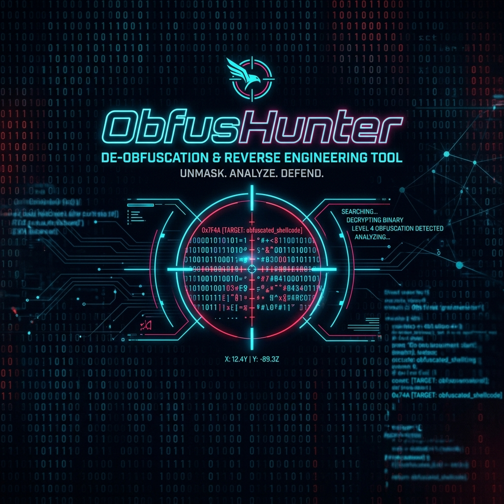

<div align="center">
  
  <h1>🛡️ ObfusHunter</h1>
  <p><b>Advanced PE Obfuscation & Protection Detector</b></p>
  <br/>
</div>

## 📌 Overview

**ObfusHunter** is a lightning-fast, C++ based static analysis tool designed to identify and analyze obfuscation techniques within Windows Portable Executable (PE) files. It heavily focuses on detecting `Obfus.h` protection patterns, junk code insertion, anti-debugging mechanisms, virtualization markers, and string obfuscation loops.

Whether you're reverse engineering malware, analyzing packed executables, or verifying compiler signatures (specifically TCC), ObfusHunter provides a clear, hex-mapped report of every suspicious pattern found.

---

## 🚀 Features

- **High-Speed Memory Mapping**: Utilizes `CreateFileMapping` to process huge PE files instantly without bogging down I/O.
- **TCC (Tiny C Compiler) Recognition**: Highly accurate detection of TCC artifacts via custom DOS stubs and x86/x64 Entry Point (EP) signatures.
- **Deep Signature Scanning**:
  - 🗑️ **Junk Code**: Identifies stack-breaking patterns and dummy instructions.
  - 🪲 **Anti-Debugging**: Detects hardware breakpoint clearing (`DR_CLEAN`), `RDTSCP` timing checks, and exception-based traps.
  - 💻 **Virtualization**: Spots VM dispatchers (`VM_DISPATCH_X86` / `X64`) and broken jumps.
  - 🏷️ **Watermarks & Fake Sections**: Finds traces of Enigma, Denuvo, Nuitka, and typical packer section names (`.vmp0`, `UPX0`, etc.).
  - 🧵 **String Obfuscation**: Heuristic engine to detect `HIDE_STRING` byte-by-byte stack construction sequences (even customized TCC variants).
- **RWX Anomaly Detection**: Flags sections marked as Read/Write/Execute.
- **Density Scoring**: Calculates marker density (hits per KB) and a threat score to gauge the intensity of the obfuscation.

---

## 🛠️ Usage

ObfusHunter is a command-line tool. Simply pass the path of the target PE file as an argument.

```cmd
ObfusHunter.exe <path_to_pe_file.exe>
```

### Example Output

```text
  ____  _      __           _    _             _            
 / __ \| |    / _|         | |  | |           | |           
| |  | | |__ | |_ _   _ ___| |__| |_   _ _ __ | |_ ___ _ __ 
| |  | | '_ \|  _| | | / __|  __  | | | | '_ \| __/ _ \ '__|
| |__| | |_) | | | |_| \__ \ |  | | |_| | | | | ||  __/ |   
 \____/|_.__/|_|  \__,_|___/_|  |_|\__,_|_| |_|\__\___|_|   

[ File Information ]
 Path:       sample_protected.exe
 Size:       231424 bytes
 Arch:       x64
 EntryPoint: 0x1A420
[+] Compiler: Tiny C (TCC)
 Language: C
[!] Obfus.h Protection: CONFIRMED
 Detection Score:   152.00
 Marker Density:    0.34 hits/KB

Detailed Detection Log (12 hits):
RVA         Offset      Category            Details
----------------------------------------------------------------------
0x00001000  0x00000400  Compiler          Tiny C (TCC) detected by Linker/Stub
0x0001A420  0x00018820  Compiler          TCC x64 EntryPoint
0x00021A50  0x0001FE50  String Obf        HIDE_STRING sequence (15 chars)
0x0002B100  0x00029500  Anti-Debug        AD_DR_CLEAN
```

---

## 🏗️ Build Instructions

The project is built for Windows using MSVC.

1. Open `ObfusHunter.sln` in **Visual Studio** (2019/2022).
2. Set configuration to `Release` / `x64` (or x86 depending on your target).
3. Build the solution (`Ctrl + Shift + B`).

---

## 🧠 Under the Hood (For Analysts)

### Heuristics & AOBs

ObfusHunter uses byte-pattern matching with wildcard (`-1`) support. 

For instance, `HIDE_STRING` detection isn't just a static signature. The engine walks through the binary looking for consecutive stack assignments:
- `mov byte ptr [rbp+YY], XX` (`C6 45 YY XX`)
- `mov byte ptr [rsp+YY], XX` (`C6 44 24 YY XX`)
- And TCC-specific variations: `mov eax, XX; mov [rbp+YY], al`

If it finds a chain of these operations (minimum 6 bytes), it flags it as an obfuscated string construction loop, revealing exactly where the string is being dynamically built in memory.

### TCC Identification
Because malware authors love lightweight compilers, ObfusHunter checks specific attributes:
- The custom DOS stub unique to TCC.
- Linker Major/Minor versions.
- The standard TCC function prologues (`push rbp; mov rbp, rsp; sub rsp, ...`) matched against the AddressOfEntryPoint.

---

## ⚖️ Disclaimer

This tool is designed for reverse engineers, malware analysts, and security researchers. It is intended for educational purposes and for analyzing binaries you are authorized to inspect.
